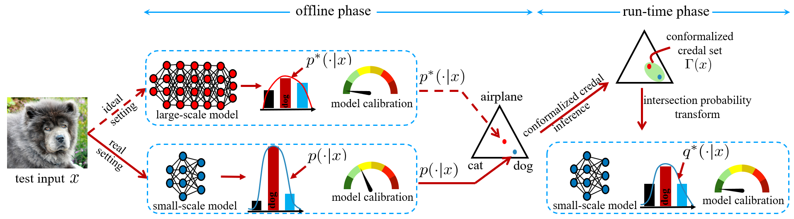

# Distilling Calibration via Conformalized Credal Inference

[](https://arxiv.org/abs/2501.06066)
[](https://pytorch.org/)
[](https://github.com/torrvision/focal_calibration/blob/main/LICENSE)

This repository contains the code for [*Distilling Calibration via Conformalized Credal Inference*](https://arxiv.org/abs/2501.06066), some elements still in progress.

If the code or the paper has been useful in your research, please add a citation to our work:

```
@inproceedings{huang2025distilling,
  title={Distilling calibration via conformalized credal inference},
  author={Huang, Jiayi and Park, Sangwoo and Paoletti, Nicola and Simeone, Osvaldo},
  booktitle={2025 International Joint Conference on Neural Networks (IJCNN)},
  pages={1--10},
  year={2025},
  organization={IEEE}
}
```

## Summary

Figure: Given an input $x$, the predictive distribution ideally coincides with that of a large-scale cloud-based model $p^*(\cdot \mid x)$. In the setting studied in this work, a small-scale edge-based model produces a probabilistic distribution $p(\cdot \mid x)$ that deviates from the reference distribution $p^*(\cdot \mid x)$, and is thus uncalibrated. The proposed conformalized credal inference-based scheme post-processes the small-scale edge model output $p(\cdot|x)$ via a simple thresholding mechanism to produce a subset $\Gamma(x)$ in the simplex of predictive distributions, with the guarantee of containing the reference distribution $p^*(\cdot|x)$ with probability $1-\epsilon$. A final calibrated predictive distribution can be obtained via ensembling or via other combining mechanisms.


## Dependencies
The code is based on PyTorch and requires a few common dependencies. It should work with newer versions as well.

## Simplex Preparation

CD-CI constructs credal sets by thresholding over a discretized probability simplex. Generate or place the precomputed simplex grid (e.g., with resolution 0.005) under `./simplex/`:

```
./simplex/0.005.npy
```

This file contains an array of shape `(N, K)` where `N` is the number of grid points and `K` is the number of classes.

## Conformalized Distillation for Credal Inference (CD-CI)

### Image Classification Task (CIFAR-3)
This task uses a 3-class subset (airplane, automobile, bird) of CIFAR-10 with ResNet-18 as the large cloud model and MiniVGG as the small edge model.

**Step 1: Train the edge model (MiniVGG)**
```bash
python train_MiniVGG.py
```

**Step 2: Run CD-CI**

```bash
python image_task.py --alpha_quant 0.1 --alpha_div 0.9
```

**Key arguments:**

| Argument | Description | Default |
|---|---|---|
| `--alpha_quant` | Target miscoverage rate (1 − confidence level) | 0.1 |
| `--alpha_div` | α parameter for α-divergence score function | 0.9 |
| `--la_approx` | Enable Laplace approximation baseline | False |


### Natural Language Inference (SNLI)
This task uses the [Stanford NLI dataset](https://nlp.stanford.edu/projects/snli/) with DeBERTa-v3-large as the cloud model and DeBERTa-v3-small as the edge model (both from the `cross-encoder` family on HuggingFace).

**Run CD-CI:**

```bash
python nlp_task.py --alpha_quant 0.1 --alpha_div 0.9
```
**Key arguments:**

| Argument | Description | Default |
|---|---|---|
| `--large_model` | HuggingFace model ID for cloud model | `cross-encoder/nli-deberta-v3-large` |
| `--small_model` | HuggingFace model ID for edge model | `cross-encoder/nli-deberta-v3-small` |

**Run with quantized small edge model:**

```bash
python nlp_task_quantize.py --bitwidth 20 --conf 0.95
```
**Key arguments:**

| Argument     | Description | Default |
|--------------|---|---------|
| `--bitwidth` | Number of bits for uniform quantization of model weights.  | 20      |
| `--conf`     | Confidence level for clipping weight values before quantization. | 0.95    |

**Run Laplace approximation baseline:**

```bash
python nlp_laplace_approx.py
```
Note: The Laplace baseline requires the [laplace](https://pypi.org/project/laplace-torch/0.1a2/) package. For more details on usage and supported options (e.g., Hessian structure, subset of weights), refer to the official documentation at https://github.com/aleximmer/Laplace.


## Questions

If you have any questions or doubts, please feel free to open an issue in this repository or reach out to me at the provided email addresses: jiayi.3.huang@kcl.ac.uk .
